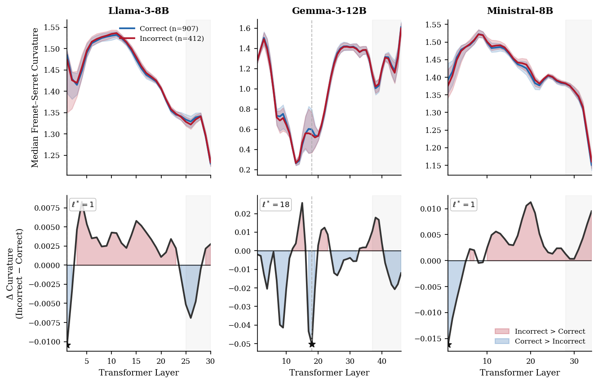
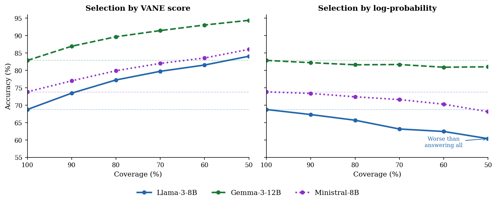
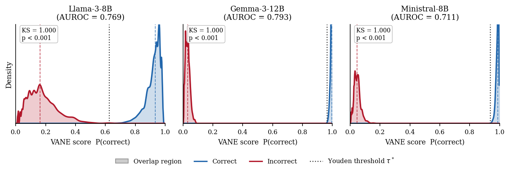
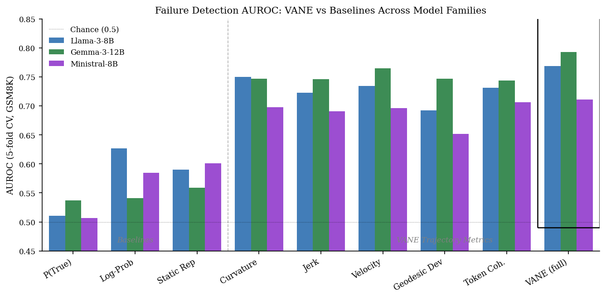

<p align="center">
  
</p>

<h1 align="center">VANE</h1>
<h3 align="center">Detecting LLM Reasoning Failures via Geometric Trajectory Analysis</h3>

<p align="center">
  <a href="https://arxiv.org/abs/XXXX.XXXXX"></a>
  <a href="https://opensource.org/licenses/MIT"></a>
  <a href="https://www.python.org/downloads/"></a>
  <a href="https://pytorch.org/"></a>
</p>

---

**VANE** (**V**elocity, **A**cceleration, and **N**onlinearity **E**stimation) is a lightweight, training-free framework for predicting whether an LLM's chain-of-thought reasoning will produce a correct answer — using only the geometry of hidden-state trajectories across transformer layers.

> **Key insight:** When a model reasons incorrectly, its internal representations follow geometrically unstable trajectories — exhibiting higher curvature, jerk, and geodesic deviation compared to correct reasoning paths.

## Key Results

### Per-Layer Curvature Profiles: Correct vs Incorrect Reasoning

<p align="center">
  
</p>

<p align="center"><em>Incorrect reasoning (red) consistently shows higher Frenet–Serret curvature than correct reasoning (blue) across all three model families. Bottom row: the difference (Incorrect − Correct) is positive throughout most layers.</em></p>

### VANE Outperforms Log-Probability at Every Coverage Level

<p align="center">
  
</p>

<p align="center"><em>Left: VANE selection monotonically improves accuracy as coverage decreases. Right: Log-probability selection can actually <b>decrease</b> accuracy below baseline — it is anti-correlated with correctness on Llama-3-8B.</em></p>

### Accuracy Gain Over Log-Probability

<p align="center">
  
</p>

<p align="center"><em>VANE's advantage over log-probability selection grows consistently as coverage decreases, reaching up to +23.7pp on Llama-3-8B at 50% coverage.</em></p>

### VANE Score Distributions

<p align="center">
  
</p>

<p align="center"><em>VANE's P(correct) separates correct (blue) and incorrect (red) samples with KS = 1.000 (p < 0.001) across all three models.</em></p>

### Ablation: Per-Metric AUROC

<p align="center">
  
</p>

<p align="center"><em>Every VANE trajectory metric individually outperforms log-probability and static representation baselines. The full VANE hybrid classifier achieves the highest AUROC.</em></p>

## The Five VANE Metrics

Given hidden states $\mathbf{h}_\ell \in \mathbb{R}^d$ at each transformer layer $\ell = 1, \dots, L$, we define layer-wise velocity vectors $\Delta_\ell = \mathbf{h}_{\ell+1} - \mathbf{h}_\ell$ and unit tangents $\hat{T}_\ell = \Delta_\ell / \lVert\Delta_\ell\rVert$:

| # | Metric | Definition | Intuition |
|:-:|:---|:---|:---|
| 1 | **Curvature** | $\kappa_\ell = \lVert \hat{T}_{\ell+1} - \hat{T}_\ell \rVert$ | Rate of directional change — sharp turns signal semantic shifts |
| 2 | **Jerk** | $J_\ell = \lVert \Delta_{\ell+1} - \Delta_\ell \rVert$ | Acceleration magnitude — high values indicate chaotic trajectory |
| 3 | **Velocity** | $v_\ell = \lVert \Delta_\ell \rVert$ | Step-size magnitude between consecutive layers |
| 4 | **Geodesic Dev** | $\mathrm{dev}_\ell = \frac{\lVert \mathbf{h}_\ell - \mathrm{lerp}(\mathbf{h}_0, \mathbf{h}_L, \ell/L) \rVert}{\lVert \mathbf{h}_L - \mathbf{h}_0 \rVert}$ | Normalised distance from straight-line chord — path efficiency |
| 5 | **Token Coherence** | $1 - \cos(\hat{T}_\ell^{(t)},\, \bar{T}_\ell)$ | How much individual token directions disagree at each layer |

Each metric produces a per-layer profile aggregated over tokens via three windows: **max** (worst-case), **mean** (average), and **ans** (answer region).

## Results Summary

| Metric | Llama-3-8B | Gemma-3-12B | Ministral-8B |
|:---|:---:|:---:|:---:|
| Log-Prob (baseline) | 0.627 | 0.541 | 0.585 |
| Static Rep (baseline) | 0.590 | 0.559 | 0.601 |
| Curvature | 0.750 | 0.747 | 0.698 |
| Jerk | 0.723 | 0.746 | 0.691 |
| Velocity | 0.734 | 0.765 | 0.696 |
| Geodesic Dev | 0.692 | 0.747 | 0.652 |
| Token Coherence | 0.731 | 0.744 | 0.706 |
| **VANE Hybrid** | **0.759** | **0.793** | **0.711** |

### Selective Prediction (out-of-fold, GSM8K)

| Coverage | Method | Llama-3-8B | Gemma-3-12B | Ministral-8B |
|:---:|:---|:---:|:---:|:---:|
| 100% | Baseline | 68.8% | 82.9% | 73.8% |
| 70% | VANE | 79.7% | 91.4% | 82.0% |
| 70% | Log-Prob | 63.2% | 81.7% | 71.6% |
| 50% | VANE | 84.1% | 94.4% | 86.0% |
| 50% | Log-Prob | 60.4% | 81.0% | 68.1% |

## Quick Start

### Installation

```bash
git clone https://github.com/hodfa840/vane.git
cd vane
pip install -r requirements.txt
```

### Run the Demo Notebook

```bash
jupyter notebook notebooks/vane_demo.ipynb
```

### Run a Full Experiment

```bash
python scripts/run_experiment.py \
    --model_id meta-llama/Meta-Llama-3-8B-Instruct \
    --benchmark gsm8k \
    --max_samples 1319 \
    --batch_size 4 \
    --output_dir results \
    --optuna 1
```

## Project Structure

```
vane/
├── README.md
├── LICENSE
├── requirements.txt
├── vane/                          # Core library
│   ├── __init__.py
│   ├── metrics.py                 # Five VANE metrics + feature extraction
│   └── plotting.py                # Paper-quality plotting functions
├── notebooks/
│   └── vane_demo.ipynb            # Comprehensive demo & analysis notebook
├── scripts/
│   ├── run_experiment.py          # Full pipeline: inference → metrics → classifier
│   └── run_benchmark.py           # Multi-benchmark runner (MATH-500, HumanEval, etc.)
└── assets/                        # Paper figures
```

## Supported Models

Any HuggingFace causal LM that returns hidden states. Evaluated on:

| Model | Parameters | GSM8K Accuracy | VANE AUROC |
|:---|:---:|:---:|:---:|
| Meta-Llama-3-8B-Instruct | 8B | 68.8% | 0.759 |
| Gemma-3-12B-IT | 12B | 82.9% | 0.793 |
| Ministral-8B-Instruct | 8B | 73.8% | 0.711 |

## Citation

```bibtex
@inproceedings{vane2025,
  title     = {VANE: Detecting LLM Reasoning Failures via Geometric Trajectory Analysis},
  author    = {Hodfa, Ali},
  booktitle = {Findings of the Association for Computational Linguistics: EMNLP 2025},
  year      = {2025}
}
```

## License

This project is licensed under the MIT License — see [LICENSE](LICENSE) for details.
