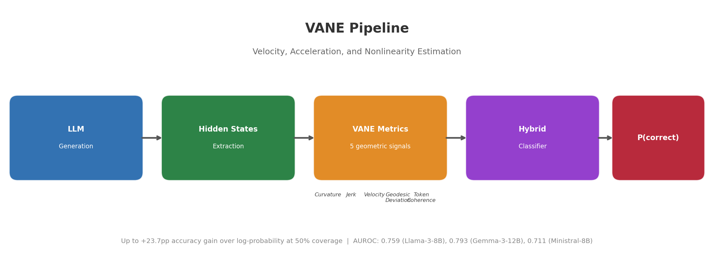
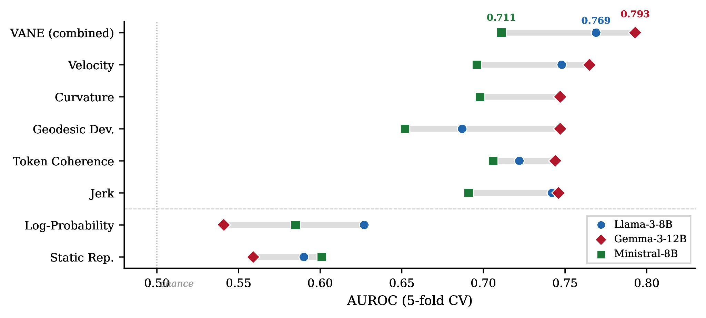
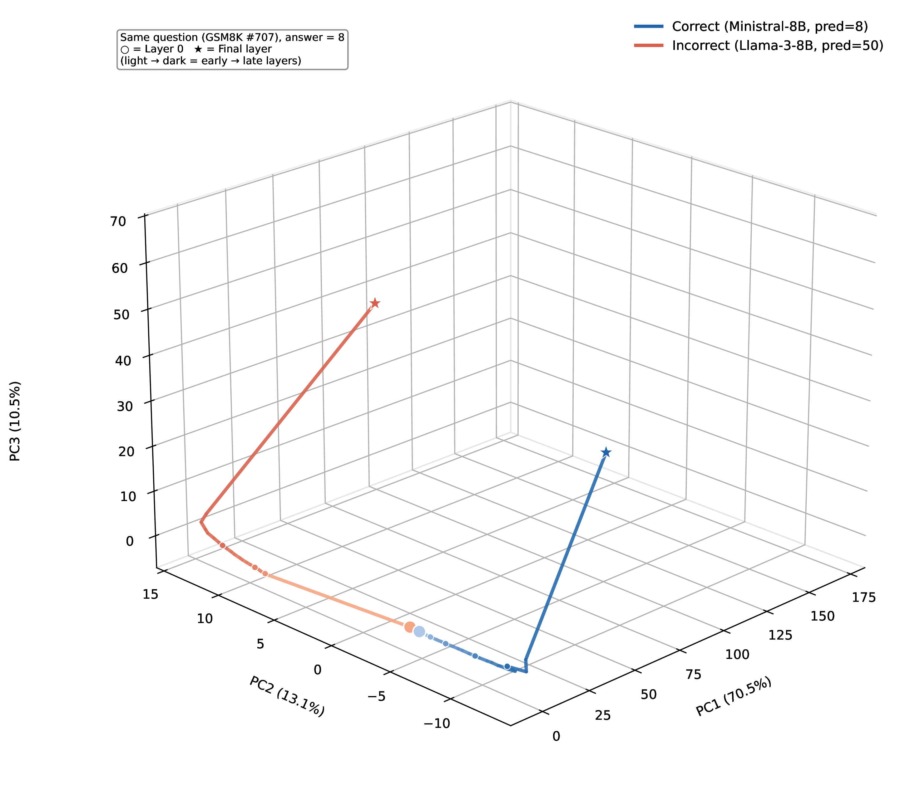
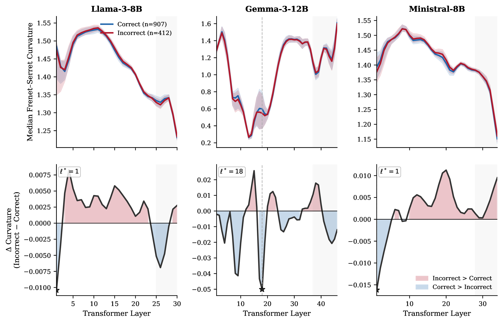
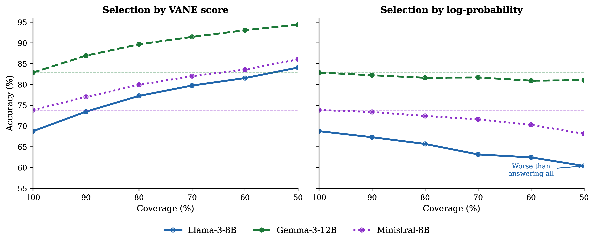
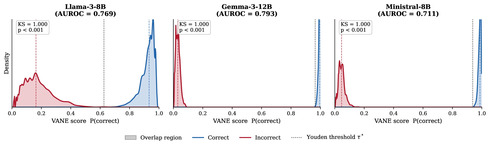
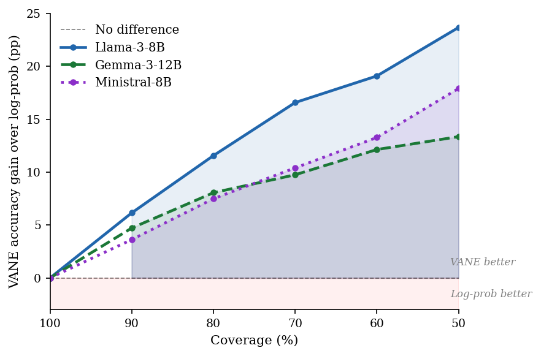

<p align="center">
  
</p>

<h1 align="center">🌬️ VANE</h1>
<h3 align="center">Detecting LLM Reasoning Failures via Geometric Trajectory Analysis</h3>

<p align="center">
  <a href="https://arxiv.org/abs/coming-soon"></a>
  <a href="https://opensource.org/licenses/MIT"></a>
  <a href="https://www.python.org/downloads/"></a>
  <a href="https://pytorch.org/"></a>
</p>

---

🌬️ **VANE** (**V**elocity, **A**cceleration, and **N**onlinearity **E**stimation) is a lightweight, training-free framework for predicting whether an LLM's chain-of-thought reasoning will produce a correct answer — using only the geometry of hidden-state trajectories across transformer layers.

> 💡 **Key insight:** When a model reasons incorrectly, its internal representations follow geometrically unstable trajectories — exhibiting higher curvature, jerk, and geodesic deviation compared to correct reasoning paths.

## ✨ Highlights

- 📐 **5 geometric metrics** computed from hidden-state trajectories — no additional training required
- 🔀 **Orthogonal to log-probability** — captures failure modes that token confidence misses
- 🎯 **Selective prediction** — at 50% coverage, VANE improves accuracy by up to **+23.7pp** over log-prob selection
- 🤖 **Model-agnostic** — evaluated on Llama-3-8B, Gemma-3-12B, and Ministral-8B

## 📊 Key Results

### Per-Metric Failure Detection AUROC

<p align="center">
  
</p>

<p align="center"><em>Every VANE trajectory metric individually outperforms log-probability and static representation baselines. VANE (combined) achieves the highest AUROC across all three model families.</em></p>

### 3D PCA Trajectories

<p align="center">
  
</p>

<p align="center"><em>Same GSM8K question answered by two models. Correct reasoning (blue, Ministral-8B) follows a smooth, directed path; incorrect reasoning (red, Llama-3-8B) exhibits geometric turbulence.</em></p>

### Per-Layer Curvature Profiles

<p align="center">
  
</p>

<p align="center"><em>Incorrect reasoning (red) consistently shows higher Frenet–Serret curvature than correct reasoning (blue). Bottom row: the difference (Incorrect − Correct) is positive through most layers.</em></p>

### Selective Prediction

<p align="center">
  
</p>

<p align="center"><em>Left: VANE accuracy rises monotonically with selectivity. Right: log-prob accuracy <b>decreases</b> on Llama and Ministral — it selects confidently wrong answers.</em></p>

### VANE Score Distributions

<p align="center">
  
</p>

<p align="center"><em>VANE's P(correct) cleanly separates correct (blue) and incorrect (red) samples across all three models (KS = 1.0, p < 0.001).</em></p>

### Accuracy Gain Over Log-Probability

<p align="center">
  
</p>

<p align="center"><em>VANE's advantage over log-prob grows monotonically with selectivity, reaching +23.7pp on Llama-3-8B at 50% coverage.</em></p>

## 📐 The Five VANE Metrics

Let $h_\ell^{(t)} \in \mathbb{R}^d$ denote the hidden state at layer $\ell$ for generated token $t$. Define the layer-wise displacement and unit tangent:

$$\Delta_\ell^{(t)} = h_{\ell+1}^{(t)} - h_\ell^{(t)}, \qquad T_\ell^{(t)} = \frac{\Delta_\ell^{(t)}}{\|\Delta_\ell^{(t)}\|}$$

**1. Velocity** — step-size magnitude between consecutive layers:

$$V_\ell = \|\Delta_\ell^{(t)}\|$$

**2. Curvature** — Frenet–Serret curvature, rate of change of direction (arc-length normalised):

$$\kappa_\ell = \|T_{\ell+1}^{(t)} - T_\ell^{(t)}\|$$

**3. Jerk** — acceleration magnitude, high values indicate chaotic trajectory:

$$J_\ell = \|\Delta_{\ell+1}^{(t)} - \Delta_\ell^{(t)}\|$$

**4. Geodesic Deviation** — normalised distance from the straight chord $h_0 \to h_L$:

$$G_\ell = \frac{\|h_\ell - (h_0 + \frac{\ell}{L-1}(h_L - h_0))\|}{\|h_L - h_0\|}$$

**5. Token Coherence** — per-layer directional agreement across generated tokens:

$$C_\ell = 1 - \cos\!\left(T_\ell^{(t)},\; \bar{T}_\ell\right), \qquad \bar{T}_\ell = \frac{1}{|\mathcal{T}|}\sum_t T_\ell^{(t)}$$

Each metric produces a **per-layer profile** aggregated over tokens via three windows: **max** (worst-case), **mean** (average), and **ans** (answer region).

## 📋 Results Summary

| Metric | Llama-3-8B | Gemma-3-12B | Ministral-8B |
|:---|:---:|:---:|:---:|
| Log-Prob (baseline) | 0.627 | 0.541 | 0.585 |
| Static Rep (baseline) | 0.590 | 0.559 | 0.601 |
| Curvature | 0.750 | 0.747 | 0.698 |
| Jerk | 0.723 | 0.746 | 0.691 |
| Velocity | 0.734 | 0.765 | 0.696 |
| Geodesic Dev | 0.692 | 0.747 | 0.652 |
| Token Coherence | 0.731 | 0.744 | 0.706 |
| 🌬️ **VANE (combined)** | **0.759** | **0.793** | **0.711** |

### 🎯 Selective Prediction (out-of-fold, GSM8K)

| Coverage | Method | Llama-3-8B | Gemma-3-12B | Ministral-8B |
|:---:|:---|:---:|:---:|:---:|
| 100% | Baseline | 68.8% | 82.9% | 73.8% |
| 70% | 🌬️ VANE | 79.7% | 91.4% | 82.0% |
| 70% | Log-Prob | 63.2% | 81.7% | 71.6% |
| 50% | 🌬️ VANE | **84.1%** | **94.4%** | **86.0%** |
| 50% | Log-Prob | 60.4% | 81.0% | 68.1% |

## 🚀 Quick Start

### Installation

```bash
git clone https://github.com/hodfa840/vane.git
cd vane
pip install -r requirements.txt
```

### 📓 Run the Demo Notebook

```bash
jupyter notebook notebooks/vane_demo.ipynb
```

### 🔬 Run a Full Experiment

```bash
python scripts/run_experiment.py \
    --model_id meta-llama/Meta-Llama-3-8B-Instruct \
    --benchmark gsm8k \
    --max_samples 1319 \
    --batch_size 4 \
    --output_dir results \
    --optuna 1
```

## 🗂️ Project Structure

```
vane/
├── README.md
├── LICENSE
├── requirements.txt
├── vane/                          # Core library
│   ├── __init__.py
│   ├── metrics.py                 # Five VANE metrics + feature extraction
│   └── plotting.py                # Paper-quality plotting functions
├── notebooks/
│   └── vane_demo.ipynb            # Comprehensive demo & analysis notebook
├── scripts/
│   ├── run_experiment.py          # Full pipeline: inference → metrics → classifier
│   └── run_benchmark.py           # Multi-benchmark runner (MATH-500, HumanEval, etc.)
└── assets/                        # Paper figures
```

## 🤖 Supported Models

Any HuggingFace causal LM that returns hidden states. Evaluated on:

| Model | Parameters | GSM8K Accuracy | VANE AUROC |
|:---|:---:|:---:|:---:|
| 🦙 Meta-Llama-3-8B-Instruct | 8B | 68.8% | 0.759 |
| 💎 Gemma-3-12B-IT | 12B | 82.9% | 0.793 |
| 🌬️ Ministral-8B-Instruct | 8B | 73.8% | 0.711 |

## 📝 Citation

```bibtex
@inproceedings{vane2026,
  title     = {VANE: Detecting LLM Reasoning Failures via Geometric Trajectory Analysis},
  author    = {Fakhar, Hoda},
  year      = {2026}
}
```

## 📄 License

This project is licensed under the MIT License — see [LICENSE](LICENSE) for details.
